Fase 1 – OBSERVAR (sin modificar código)

•	Apagar el servicio de mascotas
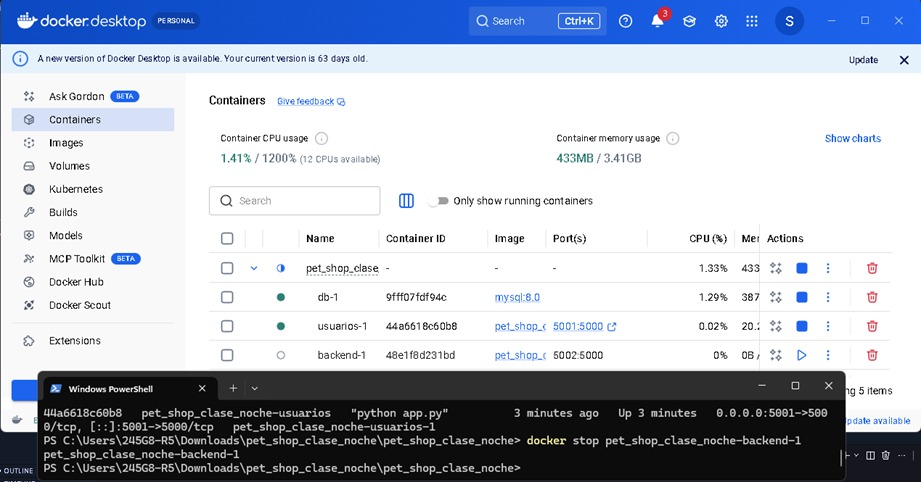
•	Hacer varias peticiones al gateway
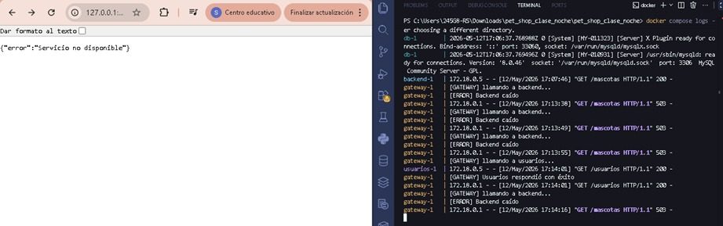
•	Revisar logs

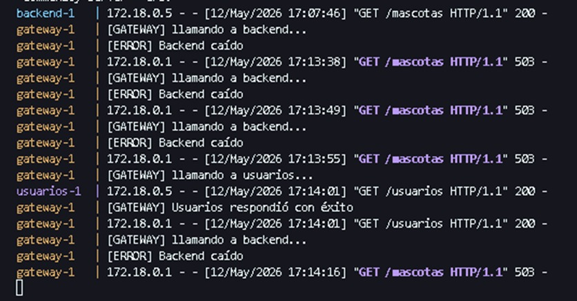
Responder:
¿Qué hace el sistema actualmente?
Rta: el gateway funciona como intermediairo entre el usuario y los servicios, cuando realiza la peticion a /mascotas, este intenta comunicarse con el backend utilizando solicitudes HTTP.
Si el servicio backend  esta activo, el sistema devuelve la información solicitada y si se encuentra apagado, el gateway ve el error, registra el fallo en los logs (intentos de conexión, errores de comunicación, timeouts y el estado de cada microservicio) y devuelve una respuesta controlada.

¿Se protege o insiste?
Rta: este realiza ambos, ya que inicialmente el sistema intenta conectarse varias veces al backend antes de considerar que el servicio falla realmente.
Aquí se configuro hasta 3 intentos automaticos, despues de varias peticiones:
-	El circuito se abre.
-	El gateway deja de enviar solicitudes al servicio.
-	Finalmente responde con errores controlados.
Todo lo anterior evita que el servico ya caido se sature.

Fase 2 – APLICAR (Extensión del Circuit Breaker)
A partir de lo implementado en clase para /mascotas, deben:
-	Aplicar el mismo comportamiento en los demás endpoints del gateway (ej: /usuarios, /resumen u otros que tengan)
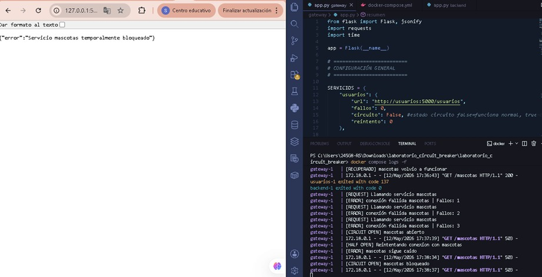
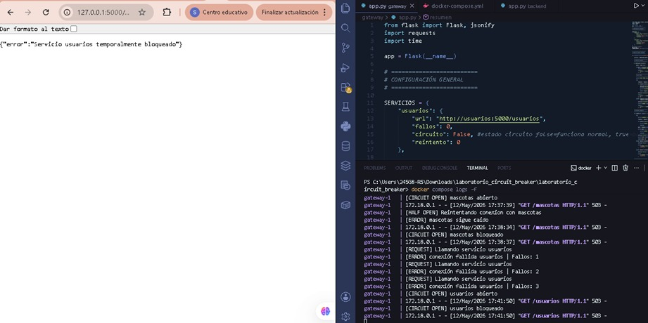
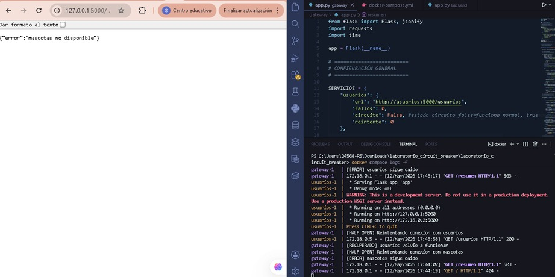
Deben analizar y decidir:
¿Cada servicio debe tener su propio contador de fallos?
Rta: si, ya que al utilizar contadores independientes para cada servicio.
Ejemplo:
-	fallos_usuarios
-	fallos_mascotas
permite controlar los errores de forma independiente y evita que fallos de un servicio afecten a los demas.

¿El circuito debe abrirse de forma independiente por servicio?
Rta: si, cada servicio maneja su propio estado de circuito.
-	circuito_usuarios_abierto = False
-	circuito_mascotas_abierto = False
Si el backend de mascotas falla, unicamente se bloquean las solicitudes relacionadas con este, mientras los demas servicios continuan funcionando normalmente y asi con los demas.
Gracias a que cada circuito se abre de forma independiente el sistema mejora su estabilidad y evita una caida general.

¿Qué pasa si falla un servicio pero el otro sigue funcionando?
Rta: si falla un servicio el gateway empieza a registrar fallos, aumenta el contador correspondiente y ocasionalmente abre el circuito.
No obstante, los demas servicios continuan respondiendo normalmente, esto demuestra una de las ventajas de trabajar con microservicios.

FASE 3 – INVESTIGAR (Half-Open)
Cada grupo debe investigar:
¿Qué significa “half-open”?
Rta: es una fase intermedia dentro del patron circuit breaker, entonces cuando el circuito permanece abierto durante cierto tiempo, el sistema permite realizar nuevamente algunas solicitudes de prueba, estas sirven para comprobar si el backend ya volvio a funcionar correctamente.
En lugar de habilitar todo el trafico inmediatamente, el gateway realiza validaciones controladas.

¿Cuándo se vuelve a intentar una llamada?
Rta: en el proyecto se configuro un tiempo de espera aproximada de 10 segundos, luego de este tiempo:
El gateway realiza un nuevo intento de conexión, el circuito entra en estado half-open y analiza la respuesta del backend.
Si el servicio responde correctamente: el cirucito se cierra, el contador de errores vuelve a cero y este continua funcionando normalmente.

¿Qué pasa si el servicio vuelve a fallar?
Rta: si el servicio no responde correctamente de nuevo, el circuito vuelve a abrirse, el tiempo de espera se reinicia y el gateway deja nuevamente de enviar solicitudes.

FASE 4 – IMPLEMENTAR (Recuperación)
Aplicar en su sistema:
-	Espera controlada (tiempo definido por usted)
-	Un nuevo intento de conexión
Decisión: 
-	cerrar circuito (si funciona)
-	volver a abrir (si falla)
Las funcionalidades agregadas fueron:
-	espera controlada  que fueron 10 seg
-	nuevo intento de conexión que se puede ver en la terminal de la imagen.
-	Cierre automatico del circuito cuando el servicio responde (terminal).
-	Reapertura  del circuido cuando el backend continua fallando (terminal)

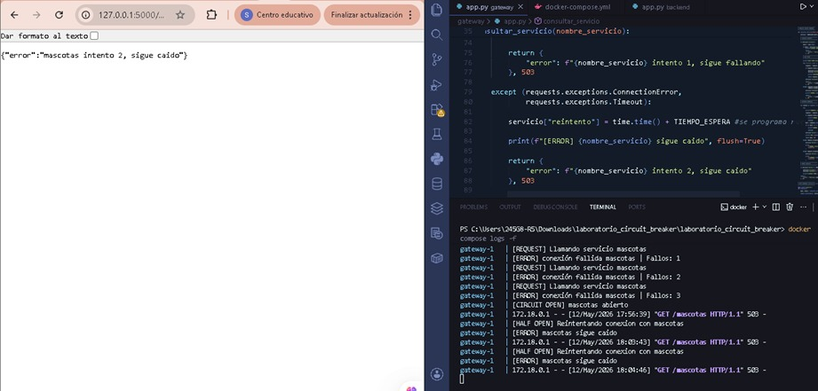

Las funcionalidades agregadas fueron:
-	espera controlada  que fueron 5 seg
-	nuevo intento de conexión que se puede ver en la terminal de la imagen.
-	Cierre automatico del circuito cuando el servicio responde (terminal).
-	Reapertura  del circuido cuando el backend continua fallando (terminal)

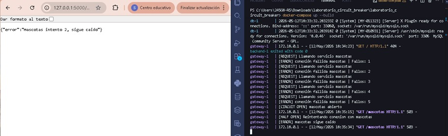

FASE 5 – VALIDAR
Probar el sistema en diferentes escenarios:
-	Servicio funcionando
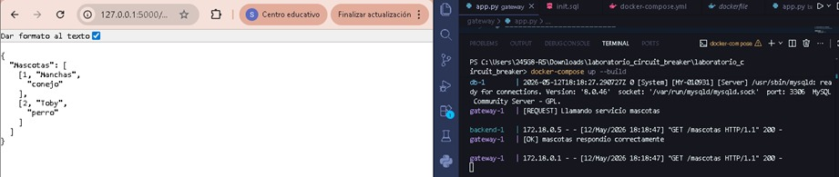
Con todos los contenedores activos, el gateway respondia normal, las solicitudes devolvian codigo HTTP 200 y la información se mostro correctamente.
Logs indican conexiones exitosas entre los servicios.

-	Servicio caído
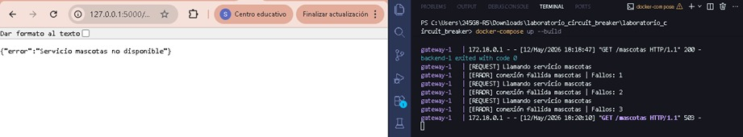
Cuando se apago el backend, comenzaron a aparecer errores de conexión, aumentaron los fallos registrados y el gateway devolvio respuestas controladas.
Logs permitieron identidicar que el servicio no estaba disponible.

-	Circuito abierto
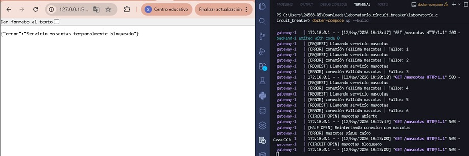
Luego de varios errores seguidos, el circuito se abrio automaticamente, el gateway dejo de enviar solicitudes al backend y respondio con codigo HTTP 503.
Esta parte ayudo a reducir  solicitudes innecesarias a un servicio caido.

-	Recuperación del servicio
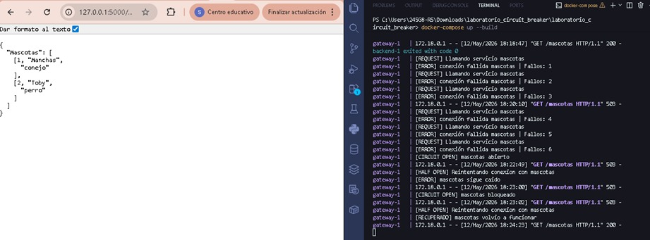
Y al finalizar se volvio a iniciar el backend desde docker, luego del tiempo de espera , el gateway realizo una nueva conexión, el servicio respondio correctamente y el circuito vovlio al estado normal.
Permitiendo validar el funcionamiento de la recuperacion automatica implementada.

Análisis final
Responder:
¿Qué cambió en el comportamiento del sistema?
Rta: antes de hacer la implementacion del circuit breaker:
-	El gateway seguia intentando conectarse continuamente a servicios que estaban caidos.
-	Los tiempos de respuesta aumentaban.
-	El sistema era menos estable por lo mencionado anteriormente.
Luego de hacer la implementacion:
-	Los errores comenzaron a controlarse automaticamente.
-	Los servicios inestables dejaron de recibir solicitudes incesarias.
-	El gateway respondio mas rapido.
-	Por ultimo el sistema logro recuperarse automaticamente cuando el backend volvio a funcionar 
Esto hizo que el sietma se voliera mas resiliente y estable.

¿Qué decisiones tomaron en la implementación?
las decisiones tomadas fueron:  utilizar contadores independientes para cada servicio, abriri circuitos separados, limitar los reintentos automaticos, implementar estado half-open, configurar tiempos de espera y tambien mantener la logica separada entre los servicios para evitar que un fallo afecte a todos los demas.

¿Qué dificultades encontraron?
Las dificultades que encontre fueron manejar corecatmente las variables globales, validar los estados open, closed y half-open.

