# Fase 1 – OBSERVAR (sin modificar código)
•	Apagar el servicio de mascotas
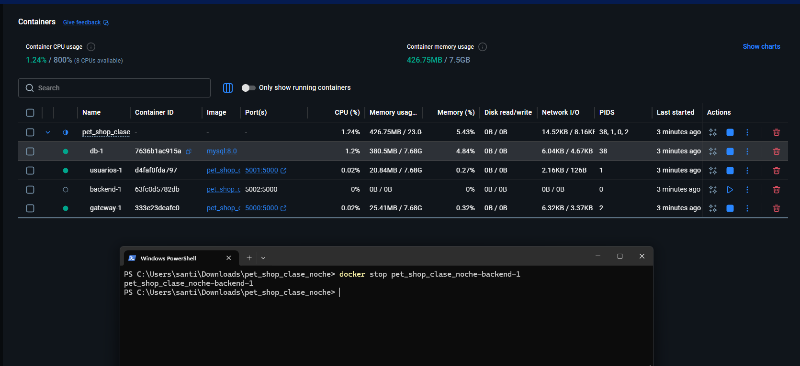

•	Hacer varias peticiones al gateway
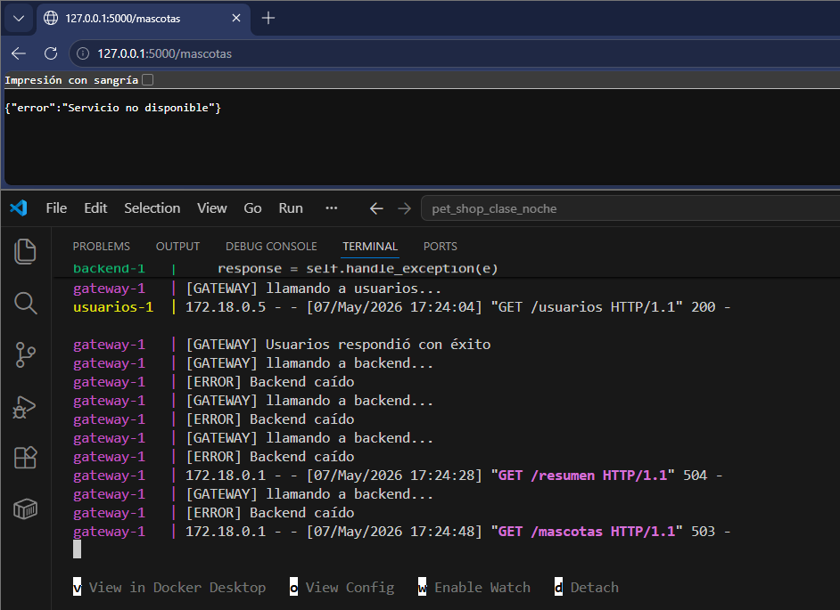
 
•	Revisar logs
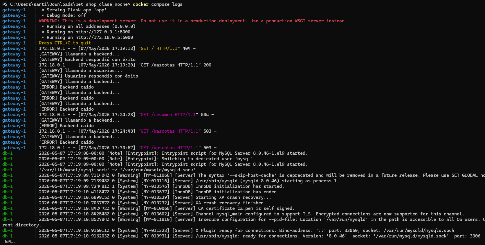
 
## Responder:
## ¿Qué hace el sistema actualmente?
Rta: el sistema funciona mediante un gateway que actúa como intermediario entre el cliente y los microservicios.
Cuando el usuario hace una petición a /mascotas, el gateway intenta comunicarse con el servicio backend correspondiente.
Entonces: 
-	Si el servicio está activo: el gateway recibe la respuesta, valida que existan datos y devuelve la información correctamente al cliente.
-	Si el servicio de mascotas se apaga: el gateway detecta que no puede conectarse, captura el error, evita que el sistema completo falle y responde con un mensaje controlado indicando que el servicio no está disponible.
Además, los logs permiten observar: intentos de conexión, errores de comunicación, timeouts y el estado de cada microservicio.

## ¿Se protege o insiste?
Rta: El sistema hace ambas cosas, pero de manera básica.
Se protege, porque: captura excepciones (ConnectionError, Timeout), evita que la aplicación colapse y responde con errores HTTP controlados como 503 Service Unavailable.
Esto demuestra un manejo básico de tolerancia a fallos.

Insiste parcialmente porque:  el gateway tiene un ciclo de hasta 3 intentos.
Sin embargo: los reintentos reales solo ocurren cuando hay Timeout, porque en caso de ConnectionError el sistema retorna inmediatamente y corta el ciclo. 
Por lo tanto:
-	ante lentitud - sí insiste
-	ante caída total del servicio - no insiste realmente.

## Explicación breve (qué hice y qué observe)
En esta fase primeramente apage el servicio de mascotas para simular la caída de un microservicio y posteriormente realize varias peticiones al gateway y los revise atreves de los logs del sistema.

Puede observar que el gateway intentaba comunicarse con el backend y al estar apagado y no encontrarlo disponible, capturaba el error y respondía con mensajes controlados, sin detener completamente el sistema. También se evidenció que existían intentos de conexión y manejo básico de excepciones, aunque todavía no se implementaba un Circuit Breaker completo.

# Fase 2 – APLICAR (Extensión del Circuit Breaker)
A partir de lo implementado en clase para /mascotas, deben:
•	Aplicar el mismo comportamiento en los demás endpoints del gateway (ej: /usuarios, /resumen u otros que tengan)
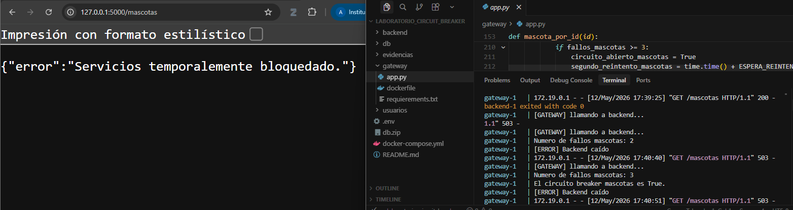
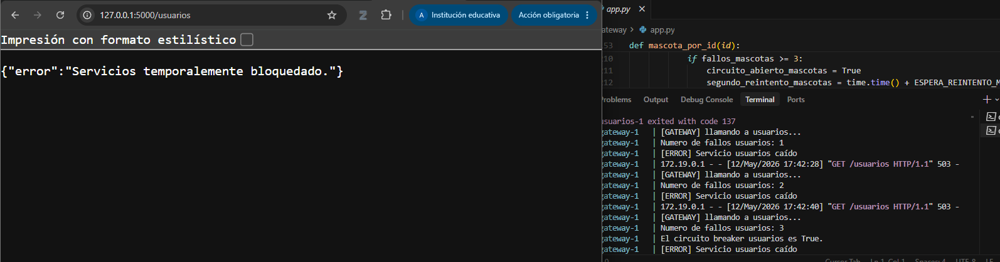
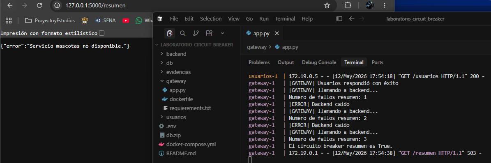

 
## Deben analizar y decidir:
## ¿Cada servicio debe tener su propio contador de fallos?
Rta: si, cada servicio debe tener su propio contador de fallos para evitar mezclar estados entre dependencias distintas.
Un ejemplo:
-	fallos_usuarios
-	fallos_mascotas
Si se utilizara un único contador global: una falla en el servicio de usuarios podría terminar afectando también el servicio de mascotas, aunque este último estuviera funcionando correctamente.
Por eso, en arquitecturas de microservicios, el monitoreo de fallos debe hacerse de forma individual por servicio.

## ¿El circuito debe abrirse de forma independiente por servicio?
Rta: si, cada servicio debe tener su propio estado de circuito:
-	circuito_usuarios_abierto = False
-	circuito_mascotas_abierto = False
El objetivo es aislar los fallos y evitar que un problema puntual afecte todo el gateway.
De esta manera: si falla usuarios, únicamente se bloquean las peticiones hacia usuarios, mientras que mascotas puede seguir funcionando normalmente.
Esto mejora: la disponibilidad, la resiliencia y la estabilidad general del sistema distribuido.

## ¿Qué pasa si falla un servicio pero el otro sigue funcionando?
Rta: 
-	El servicio que falla: comienza a acumular errores, puede abrir su circuito después de varios fallos y responde con errores controlados como 503 Service Unavailable.
-	Mientras tanto, el servicio que sigue operativo: continúa atendiendo peticiones normalmente, mantiene disponibilidad y no se ve afectado por la caída del otro backend.
Esto evita que un único punto de falla provoque una caída total del sistema.

## Explicación breve (qué hice y qué observe)
En esta fase implementé el patrón Circuit Breaker en los endpoints principales del gateway, específicamente en /mascotas y /usuarios. Para lograrlo, configuré contadores de fallos independientes y estados de circuito separados para cada microservicio.

Durante las pruebas observé que, después de varios errores consecutivos, el circuito se abría automáticamente y el gateway dejaba de realizar conexiones innecesarias hacia el servicio que se encontraba caído. Esto permitió aislar los fallos y evitar que un problema en un microservicio afectara el funcionamiento general del sistema o de los demás endpoints.

# FASE 3 – INVESTIGAR (Half-Open)
Cada grupo debe investigar:
## ¿Qué significa “half-open”?
Rta: (“semiabierto”) es una etapa intermedia del patrón Circuit Breaker. En nuestro gateway, esto significaría que después de bloquear temporalmente las peticiones hacia un servicio caído (como /mascotas o /usuarios), el sistema permite nuevamente una pequeña cantidad de solicitudes de prueba para comprobar si el backend ya volvió a funcionar correctamente. No se habilita todo el tráfico de inmediato, sino que primero se valida si el servicio responde de manera estable.

## ¿Cuándo se vuelve a intentar una llamada?
Rta: La llamada se vuelve a intentar después de que el circuito ha permanecido abierto durante un tiempo determinado. En nuestro proyecto, esto ocurriría luego de varios fallos consecutivos en el backend. El gateway espera unos segundos y posteriormente permite una petición de prueba hacia el servicio afectado. Si esa petición responde correctamente, el sistema entiende que el microservicio se recuperó y vuelve a habilitar las solicitudes normales.

## ¿Qué pasa si el servicio vuelve a fallar?
Rta: Si durante el estado half-open el servicio vuelve a presentar errores o no responde, el circuito se abre nuevamente de inmediato. Esto significa que el gateway deja otra vez de enviar peticiones hacia ese backend y responde con errores controlados como 503 Service Unavailable. En nuestro caso, por ejemplo, si el servicio de /mascotas sigue caído, el gateway continuará bloqueando temporalmente las solicitudes para evitar saturar un servicio inestable y proteger el resto del sistema distribuido.

## Explicación breve (qué hice y qué observe)
En esta etapa investigué el funcionamiento del estado Half-Open dentro del patrón Circuit Breaker. Analicé cómo el sistema puede permitir solicitudes de prueba después de que el circuito permanece abierto durante un tiempo determinado.

Observé que este mecanismo permite verificar si un microservicio ya se recuperó antes de volver a habilitar completamente las conexiones. También comprobé que, si el servicio continúa fallando durante la prueba, el circuito se vuelve a abrir automáticamente para proteger el gateway y mantener la estabilidad del sistema distribuido.

# FASE 4 – IMPLEMENTAR (Recuperación)
## Aplicar en su sistema:
•	Espera controlada (tiempo definido por usted)
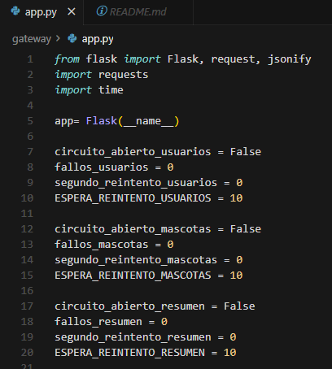
•	Un nuevo intento de conexión
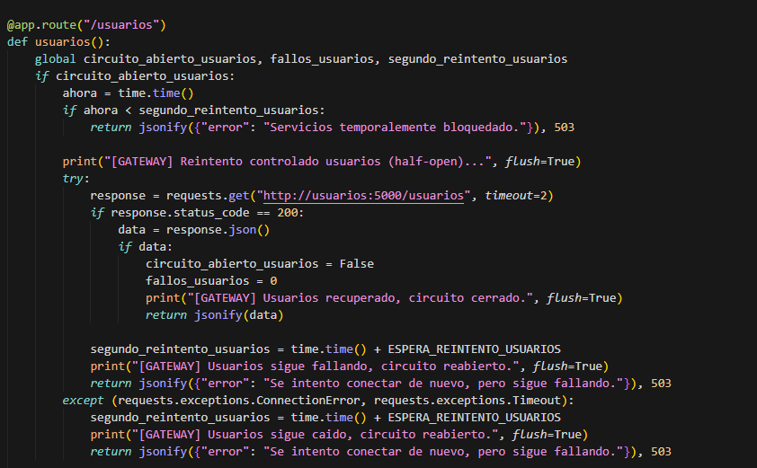
•   Decisión: 
    -	cerrar circuito (si funciona)
    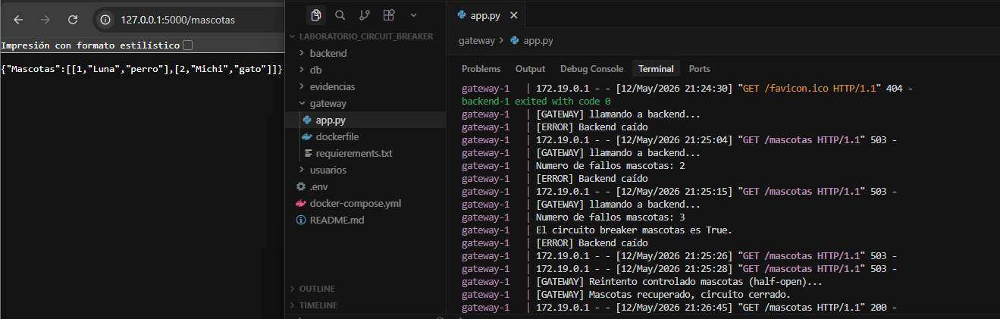
    -	volver a abrir (si falla)
    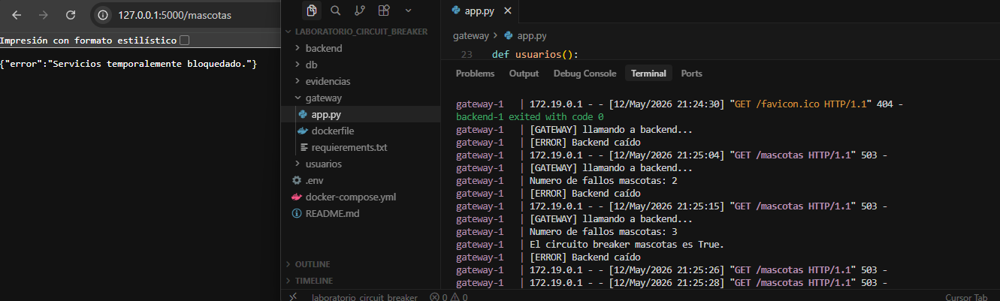

## Explicación breve (qué hice y qué observe)
En esta fase implementé el mecanismo de recuperación del Circuit Breaker utilizando el estado Half-Open. Configuré un tiempo de espera controlado para que, después de abrir el circuito por varios fallos consecutivos, el gateway pudiera volver a intentar una conexión con el backend.

Durante las pruebas observé que, mientras el circuito permanecía abierto, el sistema bloqueaba temporalmente las solicitudes hacia el servicio caído. Después del tiempo configurado, el gateway permitía una petición de prueba para verificar si el backend ya se había recuperado. Si la conexión funcionaba correctamente, el circuito se cerraba nuevamente y el servicio volvía a operar normalmente; en caso contrario, el circuito se abría otra vez automáticamente.

# FASE 5 – VALIDAR
## Probar el sistema en diferentes escenarios:
•	Servicio funcionando
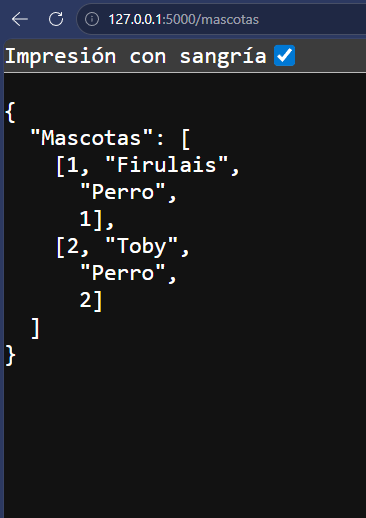
•	Servicio caído
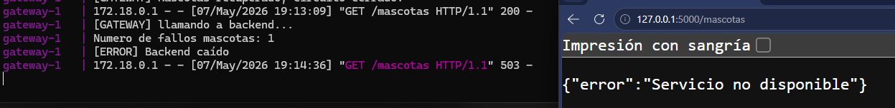
•	Circuito abierto
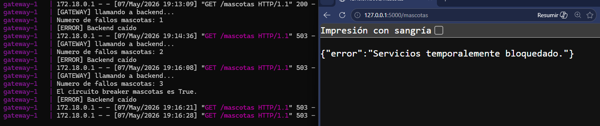
•	Recuperación del servicio
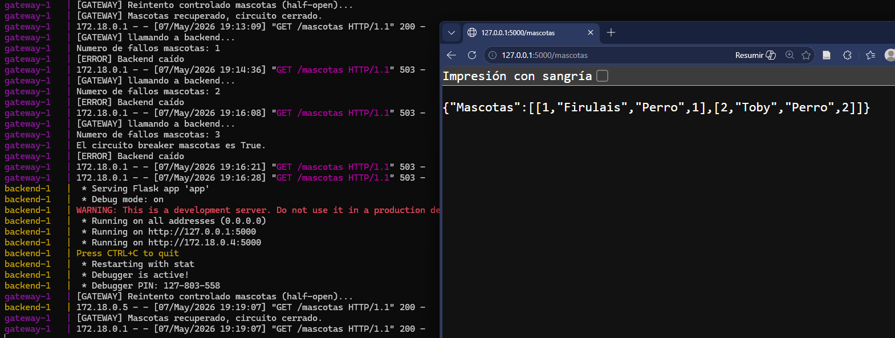
 
## Explicación breve (qué hice y qué observe)
En esta fase realicé diferentes pruebas para validar el comportamiento del Circuit Breaker y del mecanismo de recuperación implementado.

Durante la validación observé que:

cuando el servicio estaba funcionando correctamente, las peticiones respondían normalmente;
cuando el servicio se detenía, el gateway comenzaba a registrar fallos y posteriormente abría el circuito;
mientras el circuito estaba abierto, el sistema dejaba de enviar solicitudes al backend y respondía inmediatamente con errores controlados;
y finalmente, al recuperar el servicio y esperar el tiempo configurado, el gateway realizaba una petición de prueba y cerraba nuevamente el circuito si el backend respondía correctamente.

# Análisis final
• ¿Qué cambió en el comportamiento del sistema?

Inicialmente el gateway intentaba comunicarse con los microservicios cada vez que recibía una petición, incluso cuando el backend estaba caído. Esto generaba múltiples errores consecutivos y tiempos de espera innecesarios.

Después de implementar el patrón Circuit Breaker, el sistema comenzó a manejar los fallos de forma más controlada. Ahora, cuando un servicio presenta varios errores consecutivos:

el circuito se abre,
el gateway deja temporalmente de enviar solicitudes hacia ese backend,
y responde inmediatamente con errores controlados (503 Service Unavailable).

Además, se implementó un mecanismo de recuperación (Half-Open) que permite probar nuevamente la conexión después de un tiempo de espera para verificar si el servicio ya se recuperó.

• ¿Qué decisiones tomaron en la implementación?

Se decidió implementar:

un contador de fallos independiente para cada servicio,
un estado de circuito separado por endpoint,
y un tiempo de espera para manejar la recuperación automática.

También se optó por:

mantener el funcionamiento normal de los servicios que sí estaban disponibles,
evitar que un backend caído afectara todo el gateway,
y utilizar respuestas controladas para mejorar la resiliencia del sistema.

Otra decisión importante fue implementar el estado Half-Open, permitiendo intentos de prueba antes de restablecer completamente las conexiones hacia un servicio recuperado.

• ¿Qué dificultades encontraron?

Una de las principales dificultades fue entender cómo manejar correctamente los estados del circuito y los contadores de errores sin afectar otros endpoints del gateway.

También se encontraron problemas relacionados con:

nombres de contenedores en Docker,
revisión de logs,
conexión entre microservicios,
manejo de excepciones,
y pruebas de caída y recuperación de servicios.

Adicionalmente, fue necesario comprender la diferencia entre:

reintentos normales,
circuito abierto,
y estado Half-Open,
ya que cada uno modifica el comportamiento del sistema distribuido de manera distinta.
